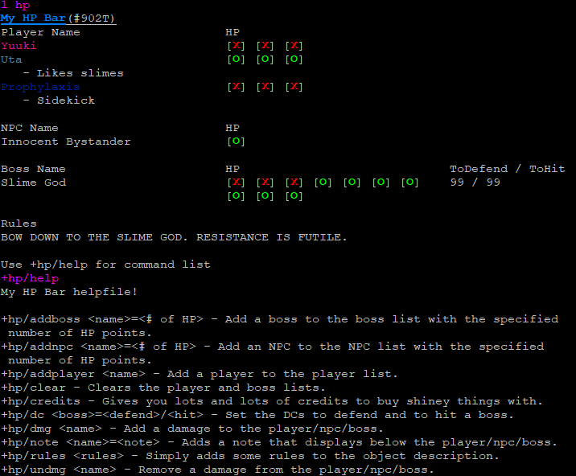

# HPBarTemplate
 A coded version of the HP Bar used in boss fights. To allow for easier, everyperson use.
 
# Preview

# How To Set Up
    @create My HP Bar
    @parent My HP Bar=#809
    @set My HP Bar=!no_command
	
# Use Lock
If you want to prevent a situation where you're carrying HP Bars but also trying to use one in a room, thus using all of them, you can set a use lock with this command:

    @lock/use My HP Bar=lock`uselock/1
	
This will mean that the commands on that HP Bar can only be used if you're in the same room as it. Not if you're carrying it.